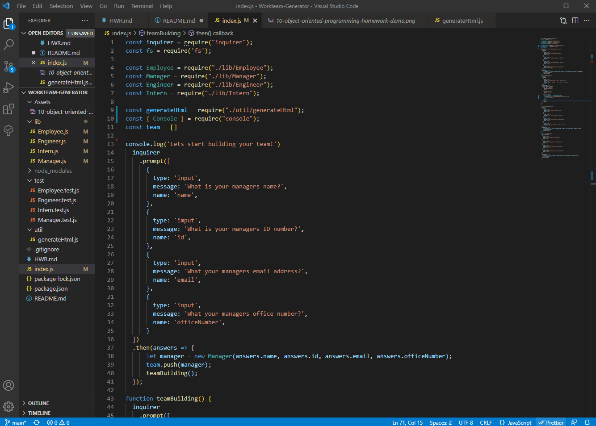

# Workteam-Generator
Building a Node.js command-line application that takes in information about employees on a software engineering team, then generates an HTML webpage that displays summaries for each person.

## Overview:
I spent way too long over thinking of how to best utilize inquirer, I kept trying to only call/use inquirer once. After realising it would be easier and nicer to make three different inquirers base on the posistion and used a .then and a function call to restart the loop. But I spent way too long trying to get my first idea to work.

### Changes-Made:
Went through and tested code with jest. Used Jest feedback to correct code and add functions into the lib files. Added and compeleted the generate FS file.

## Screenshot:

### [GitHub](https://github.com/Acanthodoris/Workteam-Generator)

## Credits:
* https://stackoverflow.com/questions/56412516/conditional-prompt-rendering-in-inquirer
* https://jestjs.io/docs/getting-started
* https://nodejs.org/api/fs.html#using-fswritefile-with-file-descriptors
* https://nodejs.dev/learn/output-to-the-command-line-using-nodejs